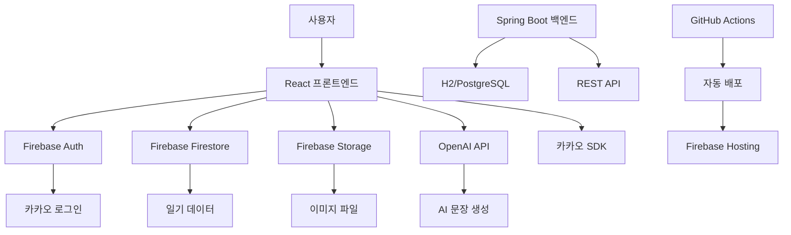

# 🌸 마음일기 - 완전한 구현 가이드

> **AI 기반 일기 작성 웹 서비스** - React + Firebase + OpenAI GPT-4o

## 📋 목차

1. [프로젝트 개요](#프로젝트-개요)
2. [기술 스택](#기술-스택)  
3. [전체 아키텍처](#전체-아키텍처)
4. [개발 환경 설정](#개발-환경-설정)
5. [프론트엔드 구현](#프론트엔드-구현)
6. [백엔드 구현](#백엔드-구현)
7. [Firebase 연동](#firebase-연동)
8. [카카오 로그인 연동](#카카오-로그인-연동)
9. [배포 가이드](#배포-가이드)
10. [트러블슈팅](#트러블슈팅)

---

## 🎯 프로젝트 개요

**마음일기**는 사용자가 일기를 작성하고, AI가 도움을 주며, 감정 통계를 볼 수 있는 현대적인 웹 애플리케이션입니다.

### 주요 기능
- ✨ **AI 문장 생성**: GPT-4o를 활용한 자동 문장 완성
- 📊 **감정 통계**: 월별 감정 분석 및 연속 작성일 추적  
- 🖼️ **이미지 업로드**: Firebase Storage 연동
- 🔐 **카카오 로그인**: Firebase Auth + 카카오 SDK
- 🎨 **애플 디자인**: 다크모드 지원 모던 UI
- 📱 **반응형 디자인**: 모바일/데스크톱 완벽 지원

---

## 🛠 기술 스택

### **프론트엔드**
```
React 19.1.0 + Vite 6.0.5
├── 상태관리: React Context API
├── 라우팅: React Router v6
├── 스타일링: Vanilla CSS + Tailwind CSS
├── 아이콘: Lucide React
└── HTTP 통신: Fetch API
```

### **백엔드**
```
Spring Boot 3.2.1 + Java 17
├── 인증: Spring Security + JWT
├── 데이터베이스: H2 (개발) / PostgreSQL (운영)
├── ORM: Spring Data JPA + Hibernate
└── API: RESTful API
```

### **클라우드 & 외부 서비스**
```
Firebase
├── Authentication (카카오 로그인)
├── Firestore (NoSQL 데이터베이스) 
├── Storage (이미지 파일)
└── Hosting (정적 사이트 배포)

External APIs
├── OpenAI GPT-4o (AI 문장 생성)
├── 카카오 SDK v2.7.4 (소셜 로그인)
└── GitHub Actions (CI/CD)
```

---

## 🏗 전체 아키텍처



---

## ⚙️ 개발 환경 설정

### **1. 필수 도구 설치**

```bash
# Node.js 18+ 설치 (https://nodejs.org)
node --version  # v18.0.0 이상 확인

# Java 17 설치 (https://adoptium.net)
java --version  # 17.0.0 이상 확인

# Git 설치 (https://git-scm.com)
git --version
```

### **2. 프로젝트 클론 및 설치**

```bash
# 프로젝트 클론
git clone https://github.com/your-username/ilgi.git
cd ilgi

# 프론트엔드 의존성 설치
cd frontend
npm install

# 백엔드 의존성 설치 (Maven)
cd ../backend
./mvnw clean install
```

### **3. 환경변수 설정**

#### **프론트엔드 환경변수**
`frontend/.env.local` 파일 생성:

```env
# OpenAI API 키
VITE_OPENAI_API_KEY=sk-proj-your-api-key-here

# 카카오 로그인
VITE_KAKAO_API_KEY=your-kakao-app-key

# Firebase 설정
VITE_FIREBASE_API_KEY=your-firebase-api-key
VITE_FIREBASE_AUTH_DOMAIN=your-project.firebaseapp.com
VITE_FIREBASE_PROJECT_ID=your-project-id
VITE_FIREBASE_STORAGE_BUCKET=your-project.appspot.com
VITE_FIREBASE_MESSAGING_SENDER_ID=123456789
VITE_FIREBASE_APP_ID=your-app-id
```

#### **백엔드 환경변수**
`backend/src/main/resources/application.yml`:

```yaml
spring:
  profiles:
    active: dev
  datasource:
    url: jdbc:h2:mem:testdb
    driver-class-name: org.h2.Driver
    username: sa
    password: 
  
  jpa:
    database-platform: org.hibernate.dialect.H2Dialect
    hibernate:
      ddl-auto: create-drop
    show-sql: true
```

---

## 🎨 프론트엔드 구현

### **핵심 구조**

```
frontend/src/
├── components/           # React 컴포넌트
│   ├── CalendarModern.jsx   # 메인 캘린더
│   ├── DiaryWrite.jsx       # 일기 작성
│   ├── DiarySearch.jsx      # 일기 검색
│   ├── EmotionStats.jsx     # 감정 통계
│   └── Login.jsx            # 로그인 페이지
├── firebase/            # Firebase 서비스
│   ├── config.js            # Firebase 설정
│   ├── authService.js       # 인증 서비스
│   ├── diaryService.js      # 일기 데이터
│   └── storageService.js    # 파일 업로드
├── services/            # 외부 API 서비스
│   ├── openaiService.js     # AI 문장 생성
│   ├── kakaoService.js      # 카카오 로그인
│   └── notificationService.js # 푸시 알림
└── utils/               # 유틸리티 함수
```

### **1. 메인 캘린더 컴포넌트**

```jsx
// components/CalendarModern.jsx
import { useState, useEffect } from 'react'
import { useTheme } from '../App'
import { getDiariesByMonth } from '../firebase/diaryService'

export default function CalendarModern({ user, onLogout }) {
  const { isDarkMode } = useTheme()
  const [currentDate, setCurrentDate] = useState(new Date())
  const [monthlyDiaries, setMonthlyDiaries] = useState([])

  // 월별 일기 데이터 로드
  useEffect(() => {
    const loadMonthlyDiaries = async () => {
      const year = currentDate.getFullYear()
      const month = currentDate.getMonth() + 1
      
      const { success, diaries } = await getDiariesByMonth(year, month)
      if (success) {
        setMonthlyDiaries(diaries)
      }
    }
    
    loadMonthlyDiaries()
  }, [currentDate])

  return (
    <div className="calendar-container">
      {/* 캘린더 그리드 구현 */}
    </div>
  )
}
```

### **2. AI 기반 일기 작성**

```jsx
// components/DiaryWrite.jsx
import { openaiService } from '../services/openaiService'

const DiaryWrite = ({ user }) => {
  const [content, setContent] = useState('')
  const [selectedText, setSelectedText] = useState('')

  // AI 문장 생성 기능
  const handleAIHelp = async () => {
    const context = {
      selectedText: selectedText || title || content.slice(0, 50),
      emotion: emotion,
      expandMode: true
    }
    
    const result = await openaiService.expandTextToDiary(context)
    
    if (result.success) {
      // 선택된 텍스트를 AI 생성 문장으로 교체
      const newContent = content.replace(selectedText, result.expandedText)
      setContent(newContent)
    }
  }

  return (
    <div className="diary-write">
      <textarea 
        value={content}
        onChange={(e) => setContent(e.target.value)}
        onMouseUp={() => {
          const selection = window.getSelection().toString()
          if (selection) setSelectedText(selection)
        }}
      />
      <button onClick={handleAIHelp}>AI 문장 만들기</button>
    </div>
  )
}
```

---

## 🚀 백엔드 구현

### **핵심 구조**

```
backend/src/main/java/com/diary/backend/
├── controller/          # REST API 컨트롤러
│   ├── DiaryController.java
│   └── HealthController.java
├── model/              # JPA 엔티티
│   ├── Diary.java
│   ├── User.java
│   └── DiaryImage.java
├── repository/         # 데이터 액세스
│   ├── DiaryRepository.java
│   └── UserRepository.java
├── service/           # 비즈니스 로직
│   ├── DiaryService.java
│   └── UserService.java
├── dto/               # 데이터 전송 객체
│   ├── DiaryDto.java
│   └── ApiResponse.java
└── config/            # 설정
    ├── SecurityConfig.java
    └── WebConfig.java
```

### **1. JPA 엔티티 설계**

```java
// model/Diary.java
@Entity
@Table(name = "diaries")
public class Diary {
    @Id
    @GeneratedValue(strategy = GenerationType.IDENTITY)
    private Long id;
    
    @Column(nullable = false)
    private String userId;
    
    @Column(nullable = false)
    private String title;
    
    @Column(columnDefinition = "TEXT")
    private String content;
    
    @Enumerated(EnumType.STRING)
    private Emotion emotion;
    
    @Column(nullable = false)
    private LocalDate date;
    
    @CreationTimestamp
    private LocalDateTime createdAt;
    
    @UpdateTimestamp
    private LocalDateTime updatedAt;
    
    // 생성자, getter, setter
}
```

### **2. REST API 컨트롤러**

```java
// controller/DiaryController.java
@RestController
@RequestMapping("/api/diaries")
@CrossOrigin(origins = "*")
public class DiaryController {
    
    @Autowired
    private DiaryService diaryService;
    
    @PostMapping
    public ResponseEntity<ApiResponse<DiaryDto>> createDiary(
            @RequestBody DiaryDto diaryDto,
            @RequestHeader("Authorization") String token) {
        
        try {
            DiaryDto createdDiary = diaryService.createDiary(diaryDto, token);
            return ResponseEntity.ok(
                ApiResponse.success("일기가 생성되었습니다.", createdDiary)
            );
        } catch (Exception e) {
            return ResponseEntity.badRequest().body(
                ApiResponse.error("일기 생성에 실패했습니다.", e.getMessage())
            );
        }
    }
    
    @GetMapping("/{date}")
    public ResponseEntity<ApiResponse<DiaryDto>> getDiaryByDate(
            @PathVariable String date,
            @RequestHeader("Authorization") String token) {
        
        DiaryDto diary = diaryService.getDiaryByDate(date, token);
        return ResponseEntity.ok(
            ApiResponse.success("일기를 조회했습니다.", diary)
        );
    }
}
```

---

## 🔥 Firebase 연동

### **1. Firebase 프로젝트 설정**

1. **Firebase Console 접속**: https://console.firebase.google.com
2. **새 프로젝트 생성**: "마음일기" 프로젝트 생성
3. **웹 앱 추가**: Firebase SDK 설정 코드 복사

### **2. Firebase 설정 파일**

```javascript
// firebase/config.js
import { initializeApp } from 'firebase/app'
import { getAuth } from 'firebase/auth'
import { getFirestore } from 'firebase/firestore'
import { getStorage } from 'firebase/storage'

const firebaseConfig = {
  apiKey: import.meta.env.VITE_FIREBASE_API_KEY,
  authDomain: import.meta.env.VITE_FIREBASE_AUTH_DOMAIN,
  projectId: import.meta.env.VITE_FIREBASE_PROJECT_ID,
  storageBucket: import.meta.env.VITE_FIREBASE_STORAGE_BUCKET,
  messagingSenderId: import.meta.env.VITE_FIREBASE_MESSAGING_SENDER_ID,
  appId: import.meta.env.VITE_FIREBASE_APP_ID
}

const app = initializeApp(firebaseConfig)

export const auth = getAuth(app)
export const db = getFirestore(app)
export const storage = getStorage(app)
export default app
```

### **3. Firestore 데이터베이스 구조**

```javascript
// 컬렉션 구조
diaries: {
  [diaryId]: {
    userId: "user123",
    title: "오늘의 일기",
    content: "오늘은 정말 좋은 하루였다...",
    emotion: "HAPPY",
    date: "2025-06-27",
    images: [
      {
        id: "img1",
        url: "https://firebase-storage.../image.jpg",
        filename: "photo.jpg"
      }
    ],
    createdAt: Timestamp,
    updatedAt: Timestamp
  }
}

users: {
  [userId]: {
    uid: "user123",
    email: "user@example.com",
    displayName: "사용자",
    photoURL: "profile.jpg",
    loginType: "kakao",
    createdAt: Timestamp,
    lastLoginAt: Timestamp
  }
}
```

---

## 🥸 카카오 로그인 연동

### **시행착오와 해결 과정**

#### **❌ 문제 1: SDK 버전 호환성**
```
오류: Kakao.Auth.login is not a function
원인: 카카오 SDK v2.7.4에서 API 변경
```

**✅ 해결:**
```javascript
// 기존 (동작 안함)
Kakao.Auth.login({
  success: (authObj) => { /* ... */ }
})

// 수정 (동작함)
const authResponse = await Kakao.Auth.authorize({
  redirectUri: window.location.origin
})
```

#### **❌ 문제 2: Firebase uid 누락**
```
오류: Cannot read properties of undefined (reading 'uid')
원인: 사용자 객체에 uid 필드가 없음
```

**✅ 해결:**
```javascript
// authService.js에서 모든 사용자 생성 시
const userInfo = {
  id: userResponse.id.toString(),
  uid: userResponse.id.toString(), // ⭐ uid 필드 추가
  name: userResponse.properties?.nickname || '카카오 사용자',
  email: userResponse.kakao_account?.email || '',
  loginType: 'kakao'
}
```

### **완성된 카카오 로그인 플로우**

```javascript
// firebase/authService.js
export const signInWithKakaoSDK = async () => {
  try {
    // 1. 카카오 인증
    const authResponse = await window.Kakao.Auth.authorize({
      redirectUri: window.location.origin
    })
    
    // 2. 사용자 정보 조회
    const userResponse = await window.Kakao.API.request({
      url: '/v2/user/me'
    })
    
    // 3. Firebase에 사용자 정보 저장
    const userInfo = {
      id: userResponse.id.toString(),
      uid: userResponse.id.toString(), // 핵심!
      name: userResponse.properties?.nickname || '카카오 사용자',
      email: userResponse.kakao_account?.email || '',
      profileImage: userResponse.properties?.profile_image || '',
      loginType: 'kakao',
      loginAt: new Date().toISOString()
    }

    await saveUserToFirestore(userInfo)
    
    return { success: true, user: userInfo }
    
  } catch (error) {
    // 폴백: 데모 모드로 전환
    return await createDemoUser()
  }
}
```

---

## 🤖 OpenAI API 연동

### **AI 문장 생성 서비스**

```javascript
// services/openaiService.js
export const openaiService = {
  async expandTextToDiary(context) {
    const { selectedText, emotion } = context
    
    if (OPENAI_API_KEY && OPENAI_API_KEY !== 'demo-mode') {
      // 실제 GPT-4o API 호출
      const systemPrompt = `당신은 일기 작성 전문가입니다. 
      사용자가 선택한 키워드나 문장을 자연스럽고 개성 있는 
      일기 문장으로 변환해주세요.
      
      - 개인적이고 진솔한 톤 사용
      - 구체적인 표현 (뻔한 표현 금지)
      - 감각적 묘사 활용
      - 30-80자 사이의 자연스러운 문장`

      const response = await fetch('https://api.openai.com/v1/chat/completions', {
        method: 'POST',
        headers: {
          'Authorization': `Bearer ${OPENAI_API_KEY}`,
          'Content-Type': 'application/json'
        },
        body: JSON.stringify({
          model: 'gpt-4o-mini',
          messages: [
            { role: 'system', content: systemPrompt },
            { role: 'user', content: `키워드: "${selectedText}"` }
          ],
          max_tokens: 150,
          temperature: 0.7
        })
      })

      const data = await response.json()
      return {
        success: true,
        expandedText: data.choices[0].message.content.trim(),
        isDemo: false
      }
    } else {
      // 데모 모드: 미리 정의된 패턴 사용
      return this.getDemoExpansion(selectedText, emotion)
    }
  }
}
```

---

## 🚀 배포 가이드

### **GitHub Actions CI/CD**

```yaml
# .github/workflows/deploy.yml
name: Deploy to Firebase

on:
  push:
    branches: [ main ]

jobs:
  deploy:
    runs-on: ubuntu-latest
    
    steps:
    - uses: actions/checkout@v3
    
    - name: Setup Node.js
      uses: actions/setup-node@v3
      with:
        node-version: '18'
        cache: 'npm'
        cache-dependency-path: frontend/package-lock.json
    
    - name: Install dependencies
      working-directory: ./frontend
      run: npm ci
    
    - name: Build project
      working-directory: ./frontend
      run: npm run build
      env:
        VITE_FIREBASE_API_KEY: ${{ secrets.VITE_FIREBASE_API_KEY }}
        VITE_OPENAI_API_KEY: ${{ secrets.VITE_OPENAI_API_KEY }}
    
    - name: Deploy to Firebase
      uses: FirebaseExtended/action-hosting-deploy@v0
      with:
        repoToken: '${{ secrets.GITHUB_TOKEN }}'
        firebaseServiceAccount: '${{ secrets.FIREBASE_SERVICE_ACCOUNT }}'
        projectId: your-project-id
        channelId: live
        entryPoint: ./frontend
```

### **Firebase Hosting 설정**

```json
// firebase.json
{
  "hosting": {
    "public": "frontend/dist",
    "ignore": [
      "firebase.json",
      "**/.*",
      "**/node_modules/**"
    ],
    "rewrites": [
      {
        "source": "**",
        "destination": "/index.html"
      }
    ],
    "headers": [
      {
        "source": "**/*.@(js|css)",
        "headers": [
          {
            "key": "Cache-Control",
            "value": "max-age=31536000"
          }
        ]
      }
    ]
  }
}
```

---

## 🔧 트러블슈팅

### **1. 개발 서버 실행 문제**

**문제**: `npm run dev` 실행 시 오류
```bash
Error: Failed to resolve entry for package "lucide-react"
```

**해결**:
```bash
# 의존성 재설치
rm -rf node_modules package-lock.json
npm install

# 또는 캐시 정리
npm cache clean --force
npm install
```

### **2. Firebase 연결 오류**

**문제**: Firebase 초기화 실패
```
FirebaseError: Firebase configuration object provided is invalid
```

**해결**: 환경변수 확인
```bash
# .env.local 파일 존재 확인
ls -la frontend/.env.local

# 환경변수 값 확인 (개발자 도구 콘솔)
console.log(import.meta.env.VITE_FIREBASE_API_KEY)
```

### **3. 카카오 SDK 로딩 오류**

**문제**: `Kakao is not defined`
```javascript
ReferenceError: Kakao is not defined
```

**해결**: `index.html`에 SDK 스크립트 추가
```html
<!-- public/index.html -->
<script src="https://t1.kakaocdn.net/kakao_js_sdk/2.7.4/kakao.min.js"></script>
```

### **4. CORS 오류**

**문제**: 백엔드 API 호출 시 CORS 차단
```
Access to fetch at 'http://localhost:8080/api/diaries' from origin 'http://localhost:5173' has been blocked by CORS policy
```

**해결**: Spring Boot CORS 설정
```java
@Configuration
public class WebConfig implements WebMvcConfigurer {
    @Override
    public void addCorsMappings(CorsRegistry registry) {
        registry.addMapping("/api/**")
                .allowedOrigins("http://localhost:5173", "https://your-domain.web.app")
                .allowedMethods("GET", "POST", "PUT", "DELETE", "OPTIONS")
                .allowedHeaders("*")
                .allowCredentials(true);
    }
}
```

---

## 📚 추가 학습 자료

### **React/JavaScript**
- [React 공식 문서](https://react.dev)
- [JavaScript 완벽 가이드](https://developer.mozilla.org/ko/docs/Web/JavaScript)
- [Vite 빌드 도구](https://vitejs.dev)

### **Firebase**
- [Firebase 공식 문서](https://firebase.google.com/docs)
- [Firestore 시작하기](https://firebase.google.com/docs/firestore)
- [Firebase Auth](https://firebase.google.com/docs/auth)

### **Spring Boot**
- [Spring Boot 가이드](https://spring.io/guides/gs/spring-boot/)
- [Spring Data JPA](https://spring.io/projects/spring-data-jpa)
- [Spring Security](https://spring.io/projects/spring-security)

### **API 연동**
- [OpenAI API 문서](https://platform.openai.com/docs)
- [카카오 로그인 가이드](https://developers.kakao.com/docs/latest/ko/kakaologin/common)

---

## 🎯 다음 단계

1. **성능 최적화**: React.memo, 이미지 lazy loading
2. **테스트 코드**: Jest, React Testing Library
3. **PWA 구현**: 오프라인 지원, 설치 가능
4. **실시간 기능**: WebSocket, 실시간 알림
5. **확장 기능**: 일기 공유, 친구 기능

---

## 🤝 기여하기

1. Fork the Project
2. Create your Feature Branch (`git checkout -b feature/AmazingFeature`)
3. Commit your Changes (`git commit -m 'Add some AmazingFeature'`)
4. Push to the Branch (`git push origin feature/AmazingFeature`)
5. Open a Pull Request

---

## 📄 라이선스

이 프로젝트는 MIT 라이선스 하에 있습니다. 자세한 내용은 `LICENSE` 파일을 참고하세요.

---

**⭐ 이 프로젝트가 도움이 되었다면 Star를 눌러주세요!**
