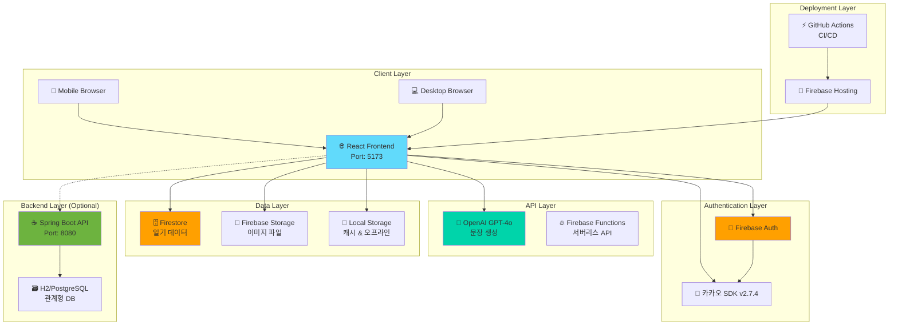

# 🌸 마음일기 - AI 기반 감정 일기 웹 서비스

> **"매일의 감정을 기록하고, AI가 도와주는 글쓰기와 함께 나만의 감정 통계를 확인할 수 있는 현대적인 일기 웹 애플리케이션"**
> 
> React 19 + Firebase + OpenAI GPT-4o + 카카오 로그인을 결합한 풀스택 프로젝트

[](https://github.com/your-username/ilgi/actions)
[](https://reactjs.org/)
[](https://firebase.google.com/)
[](https://openai.com/)

## 📋 목차

1. [프로젝트 개요](#-프로젝트-개요)
2. [기술 스택](#-기술-스택)
3. [전체 아키텍처](#-전체-아키텍처)
4. [개발 환경 설정](#-개발-환경-설정)
5. [프론트엔드 구현](#-프론트엔드-구현)
6. [백엔드 구현](#-백엔드-구현)
7. [Firebase 연동](#-firebase-연동)
8. [카카오 로그인 연동](#-카카오-로그인-연동)
9. [배포 가이드](#-배포-가이드)
10. [트러블슈팅](#-트러블슈팅)
11. [📚 코드 리뷰](#-코드-리뷰)

---

## 🎯 프로젝트 개요

**마음일기**는 단순한 일기 애플리케이션을 넘어, 사용자의 감정을 AI가 이해하고 도움을 주는 혁신적인 감정 기록 플랫폼입니다. 

매일의 감정을 5가지 카테고리(기쁨, 슬픔, 화남, 평온, 불안)로 분류하여 기록하고, OpenAI GPT-4o의 도움으로 키워드를 자연스러운 문장으로 확장할 수 있습니다. 또한 월별 감정 통계, 연속 작성일 추적, 이미지 첨부, 푸시 알림 등 현대적인 일기 앱의 모든 기능을 제공합니다.

### ✨ 주요 기능

- **🤖 AI 문장 생성**: GPT-4o를 활용한 키워드→문장 자동 확장 기능
- **📊 감정 통계 대시보드**: 월별 감정 분포, 연속 작성일, 주간 패턴 분석
- **🖼️ 이미지 업로드**: Firebase Storage 연동으로 사진과 함께 일기 작성
- **🔐 소셜 로그인**: 카카오 SDK v2.7.4를 통한 간편 로그인
- **🎨 애플 스타일 디자인**: SF Pro Display 폰트와 다크모드를 지원하는 모던 UI
- **📱 반응형 디자인**: 모바일부터 데스크톱까지 완벽한 반응형 지원
- **🔔 스마트 알림**: 매일 18시 일기 작성 알림 및 연속 작성일 축하 알림
- **🔍 전문 검색**: 제목과 내용을 통합 검색하는 고급 검색 기능

### 🌟 프로젝트의 특별함

1. **AI 기반 글쓰기 도움**: 단순한 텍스트 입력이 아닌, AI가 사용자의 감정과 상황을 이해하여 자연스러운 문장으로 확장
2. **감정 데이터 시각화**: 일기 데이터를 기반으로 한 개인 감정 패턴 분석 및 통계 제공
3. **애플 생태계 UI/UX**: iOS Human Interface Guidelines를 참고한 세련된 디자인
4. **실시간 동기화**: Firebase를 통한 실시간 데이터 동기화 및 오프라인 지원
5. **확장 가능한 아키텍처**: Spring Boot 백엔드와 React 프론트엔드의 완전 분리형 설계

---

## 🛠 기술 스택

### **Frontend Architecture**
```
React 19.1.0 + Vite 6.0.5
├── 🎨 UI Framework: Vanilla CSS + Tailwind CSS 3.4.17
├── 🧭 Routing: React Router DOM v6
├── 🏪 State Management: React Context API + Local Storage
├── 🔥 Authentication: Firebase Auth v11
├── 🗄️ Database: Firebase Firestore v11
├── 📁 File Storage: Firebase Storage v11
├── 🎭 Icons: Lucide React v0.468.0
└── 🌐 HTTP Client: Native Fetch API
```

### **Backend Architecture**
```
Spring Boot 3.2.1 + Java 17
├── 🔐 Security: Spring Security 6 + JWT
├── 🗃️ Database: H2 (dev) / PostgreSQL (prod)
├── 🔄 ORM: Spring Data JPA + Hibernate 6
├── 📋 Validation: Jakarta Validation API
├── 🎯 API Documentation: Spring Boot Actuator
└── 🧪 Testing: JUnit 5 + Mockito
```

### **Cloud & External Services**
```
🔥 Firebase Platform
├── Authentication: 소셜 로그인 (카카오)
├── Firestore: NoSQL 실시간 데이터베이스
├── Storage: 이미지 파일 저장소
└── Hosting: 정적 사이트 배포

🤖 AI & External APIs
├── OpenAI GPT-4o: 자연어 처리 및 문장 생성
├── 카카오 SDK v2.7.4: 소셜 로그인
└── GitHub Actions: CI/CD 자동화

🛠 DevOps & Tools
├── GitHub: 버전 관리 및 협업
├── Firebase CLI: 배포 자동화
└── ESLint + Prettier: 코드 품질 관리
```

---

## 🏗 전체 아키텍처



---

## ⚙️ 개발 환경 설정

### **시스템 요구사항**

| 구분 | 요구사항 | 권장 버전 |
|------|----------|-----------|
| **Node.js** | 18.0.0 이상 | 20.11.0 |
| **Java** | 17.0.0 이상 | 17.0.9 |
| **Git** | 2.30.0 이상 | Latest |
| **브라우저** | Chrome 90+ | Chrome Latest |

### **1단계: 프로젝트 클론 및 설치**

```bash
# 1. 프로젝트 클론
git clone https://github.com/your-username/ilgi.git
cd ilgi

# 2. 프론트엔드 의존성 설치
cd frontend
npm install

# 3. 백엔드 의존성 설치 (Maven)
cd ../backend
./mvnw clean install  # Linux/macOS
# 또는
mvnw.cmd clean install  # Windows
```

### **2단계: 환경변수 설정**

#### **프론트엔드 환경변수**
`frontend/.env.local` 파일 생성:

```env
# OpenAI API 설정
VITE_OPENAI_API_KEY=sk-proj-your-openai-api-key

# 카카오 로그인 설정
VITE_KAKAO_API_KEY=your-kakao-javascript-key

# Firebase 설정
VITE_FIREBASE_API_KEY=your-firebase-api-key
VITE_FIREBASE_AUTH_DOMAIN=your-project.firebaseapp.com
VITE_FIREBASE_PROJECT_ID=your-project-id
VITE_FIREBASE_STORAGE_BUCKET=your-project.appspot.com
VITE_FIREBASE_MESSAGING_SENDER_ID=123456789
VITE_FIREBASE_APP_ID=1:123456789:web:abcdef123456

# 개발 모드 설정
VITE_APP_ENV=development
VITE_API_BASE_URL=http://localhost:8080/api
```

#### **백엔드 환경변수**
`backend/src/main/resources/application.yml`:

```yaml
spring:
  profiles:
    active: dev
    
  # 데이터베이스 설정 (H2 - 개발용)
  datasource:
    url: jdbc:h2:mem:testdb
    driver-class-name: org.h2.Driver
    username: sa
    password: 
    
  # JPA 설정
  jpa:
    database-platform: org.hibernate.dialect.H2Dialect
    hibernate:
      ddl-auto: create-drop
    show-sql: true
    properties:
      hibernate:
        format_sql: true
        
  # H2 Console 설정 (개발용)
  h2:
    console:
      enabled: true
      path: /h2-console

# 서버 설정
server:
  port: 8080
  servlet:
    context-path: /api

# 로깅 설정
logging:
  level:
    com.diary.backend: DEBUG
    org.springframework.security: DEBUG
```

### **3단계: 개발 서버 실행**

```bash
# 터미널 1: 프론트엔드 서버 실행
cd frontend
npm run dev
# 🚀 http://localhost:5173 에서 접속 가능

# 터미널 2: 백엔드 서버 실행 (선택사항)
cd backend
./mvnw spring-boot:run
# 🚀 http://localhost:8080 에서 API 접속 가능
```

---

## 🎨 프론트엔드 구현

### **프로젝트 구조**

```
frontend/
├── public/                  # 정적 파일
│   ├── manifest.json           # PWA 매니페스트
│   ├── favicon.ico             # 파비콘
│   └── app-icon.png            # 앱 아이콘
├── src/
│   ├── components/             # React 컴포넌트
│   │   ├── CalendarModern.jsx      # 🗓️ 메인 캘린더 (애플 스타일)
│   │   ├── DiaryWrite.jsx          # ✍️ 일기 작성 (AI 연동)
│   │   ├── DiarySearch.jsx         # 🔍 일기 검색
│   │   ├── DiaryView.jsx           # 👁️ 일기 상세보기
│   │   ├── EmotionStats.jsx        # 📊 감정 통계 대시보드
│   │   ├── StatsPage.jsx           # 📈 통계 페이지 래퍼
│   │   ├── Login.jsx               # 🔐 로그인 페이지 (카카오)
│   │   └── Navbar.jsx              # 🧭 네비게이션 바
│   ├── firebase/               # Firebase 서비스
│   │   ├── config.js               # 🔥 Firebase 설정
│   │   ├── authService.js          # 🔐 인증 서비스
│   │   ├── diaryService.js         # 📝 일기 CRUD
│   │   └── storageService.js       # 📁 파일 업로드
│   ├── services/               # 외부 API 서비스
│   │   ├── openaiService.js        # 🤖 AI 문장 생성
│   │   ├── kakaoService.js         # 🥸 카카오 로그인
│   │   ├── imageService.js         # 🖼️ 이미지 처리
│   │   └── notificationService.js  # 🔔 푸시 알림
│   ├── utils/                  # 유틸리티 함수
│   ├── App.jsx                 # 🏠 메인 앱 컴포넌트
│   ├── App.css                 # 🎨 글로벌 스타일
│   ├── index.css               # 🎨 기본 스타일
│   └── main.jsx                # 🚀 앱 엔트리 포인트
├── package.json                # 📦 의존성 관리
├── vite.config.js              # ⚡ Vite 설정
├── tailwind.config.js          # 🎨 Tailwind 설정
└── eslint.config.js            # 📏 ESLint 설정
```

### **핵심 컴포넌트 구현**

#### **1. AI 기반 일기 작성 컴포넌트**

```jsx
// components/DiaryWrite.jsx
import { useState } from 'react'
import { openaiService } from '../services/openaiService'
import { createDiary, updateDiary } from '../firebase/diaryService'

const DiaryWrite = ({ user, date }) => {
  const [content, setContent] = useState('')
  const [selectedText, setSelectedText] = useState('')
  const [emotion, setEmotion] = useState('')
  const [loading, setLoading] = useState(false)

  // AI 문장 생성 기능
  const handleAIHelp = async () => {
    if (!selectedText && !content) {
      alert('키워드를 입력하거나 텍스트를 선택해주세요')
      return
    }

    setLoading(true)
    try {
      const context = {
        selectedText: selectedText || content.slice(-50),
        emotion: emotion,
        expandMode: true
      }
      
      const result = await openaiService.expandTextToDiary(context)
      
      if (result.success) {
        const newContent = selectedText 
          ? content.replace(selectedText, result.expandedText)
          : content + ' ' + result.expandedText
          
        setContent(newContent.trim())
        setSelectedText('')
      }
    } catch (error) {
      console.error('AI 도움 요청 실패:', error)
    } finally {
      setLoading(false)
    }
  }

  return (
    <div className="diary-write-container">
      {/* AI 도움 버튼 */}
      <button
        onClick={handleAIHelp}
        disabled={loading}
        className="ai-help-button"
      >
        {loading ? '생성 중...' : '🤖 AI 문장 만들기'}
      </button>
      
      {/* 텍스트 영역 */}
      <textarea
        value={content}
        onChange={(e) => setContent(e.target.value)}
        onMouseUp={() => {
          const selection = window.getSelection().toString()
          if (selection) setSelectedText(selection)
        }}
        placeholder="키워드나 문장을 입력하고 드래그한 후 'AI 문장 만들기'를 클릭하세요"
      />
    </div>
  )
}
```

#### **2. 감정 통계 대시보드**

```jsx
// components/EmotionStats.jsx
import { useState, useEffect } from 'react'
import { getAllDiaries } from '../firebase/diaryService'

const EmotionStats = () => {
  const [stats, setStats] = useState({
    totalDiaries: 0,
    streakDays: 0,
    emotionCounts: {},
    weeklyPattern: []
  })

  useEffect(() => {
    const loadStats = async () => {
      const { success, diaries } = await getAllDiaries(365)
      if (success) {
        // 감정별 통계 계산
        const emotionCounts = {}
        diaries.forEach(diary => {
          emotionCounts[diary.emotion] = (emotionCounts[diary.emotion] || 0) + 1
        })

        // 연속 작성일 계산
        const streakDays = calculateStreakDays(diaries)

        setStats({
          totalDiaries: diaries.length,
          streakDays,
          emotionCounts,
          weeklyPattern: calculateWeeklyPattern(diaries)
        })
      }
    }

    loadStats()
  }, [])

  return (
    <div className="emotion-stats">
      <div className="stats-grid">
        <div className="stat-card">
          <h3>총 일기 수</h3>
          <p className="stat-number">{stats.totalDiaries}개</p>
        </div>
        
        <div className="stat-card">
          <h3>연속 작성일</h3>
          <p className="stat-number">{stats.streakDays}일</p>
        </div>
        
        {/* 감정별 통계 차트 */}
        <div className="emotion-chart">
          {Object.entries(stats.emotionCounts).map(([emotion, count]) => (
            <div key={emotion} className="emotion-bar">
              <span>{emotion}</span>
              <div className="bar" style={{ width: `${(count / stats.totalDiaries) * 100}%` }}>
                {count}
              </div>
            </div>
          ))}
        </div>
      </div>
    </div>
  )
}
```

---

## ☕ 백엔드 구현

### **Spring Boot 아키텍처**

```
backend/src/main/java/com/diary/backend/
├── DiaryBackendApplication.java    # 🚀 메인 애플리케이션
├── config/                         # ⚙️ 설정 클래스
│   ├── SecurityConfig.java             # 🔐 Spring Security 설정
│   └── WebConfig.java                  # 🌐 CORS 및 Web 설정
├── controller/                     # 🎮 REST API 컨트롤러
│   ├── DiaryController.java            # 📝 일기 API
│   ├── HealthController.java           # ❤️ 헬스체크 API
│   └── GlobalExceptionHandler.java     # 🚨 전역 예외 처리
├── dto/                           # 📦 데이터 전송 객체
│   ├── ApiResponse.java                # 🔄 표준 API 응답
│   └── DiaryDto.java                   # 📝 일기 DTO
├── model/                         # 🗄️ JPA 엔티티
│   ├── Diary.java                      # 📖 일기 엔티티
│   ├── DiaryImage.java                 # 🖼️ 일기 이미지 엔티티
│   └── User.java                       # 👤 사용자 엔티티
├── repository/                    # 🏪 데이터 접근 계층
│   ├── DiaryRepository.java            # 📝 일기 저장소
│   └── UserRepository.java             # 👤 사용자 저장소
└── service/                       # 🔧 비즈니스 로직
    ├── DiaryService.java               # 📝 일기 서비스
    └── UserService.java                # 👤 사용자 서비스
```

---

## 🔥 Firebase 연동

### **Firestore 인덱스 설정**

Firebase에서 복합 쿼리를 위한 인덱스 생성이 필요합니다:

```javascript
// 필요한 복합 인덱스
// 1. userId + date (desc) - 최신 일기 조회용
// 2. userId + date (asc) - 월별 일기 조회용
// 3. userId + createdAt (desc) - 생성일 기준 정렬

// Firebase Console > Firestore > 인덱스에서 생성
```

### **Firestore 보안 규칙**

```javascript
// firestore.rules
rules_version = '2';
service cloud.firestore {
  match /databases/{database}/documents {
    // 일기 컬렉션 보안 규칙
    match /diaries/{diaryId} {
      allow read, write: if request.auth != null 
        && request.auth.uid == resource.data.userId;
      allow create: if request.auth != null 
        && request.auth.uid == request.resource.data.userId;
    }
    
    // 사용자 컬렉션 보안 규칙
    match /users/{userId} {
      allow read, write: if request.auth != null 
        && request.auth.uid == userId;
    }
  }
}
```

---

## 🥸 카카오 로그인 연동

### **카카오 개발자 콘솔 설정**

1. **카카오 개발자 콘솔** 접속: https://developers.kakao.com
2. **애플리케이션 추가**: "마음일기" 앱 생성
3. **플랫폼 설정**: Web 플랫폼 추가
4. **Redirect URI 설정**: `http://localhost:5173`, 배포 도메인 추가
5. **동의항목 설정**: 닉네임, 이메일 필수 동의

---

## 🚀 배포 가이드

### **Firebase Hosting 배포**

```bash
# 1. Firebase CLI 설치
npm install -g firebase-tools

# 2. Firebase 로그인
firebase login

# 3. 프로젝트 초기화 (최초 1회만)
firebase init hosting

# 4. 프론트엔드 빌드
cd frontend
npm run build

# 5. Firebase 배포
firebase deploy --only hosting
```

### **GitHub Actions 자동 배포**

`.github/workflows/deploy.yml`:

```yaml
name: Deploy to Firebase Hosting
on:
  push:
    branches: [ main ]

jobs:
  build-and-deploy:
    runs-on: ubuntu-latest
    steps:
      - uses: actions/checkout@v3
      
      - name: Setup Node.js
        uses: actions/setup-node@v3
        with:
          node-version: '20'
          cache: 'npm'
          cache-dependency-path: frontend/package-lock.json
      
      - name: Install dependencies
        run: |
          cd frontend
          npm ci
      
      - name: Build
        run: |
          cd frontend
          npm run build
      
      - name: Deploy to Firebase
        uses: FirebaseExtended/action-hosting-deploy@v0
        with:
          repoToken: '${{ secrets.GITHUB_TOKEN }}'
          firebaseServiceAccount: '${{ secrets.FIREBASE_SERVICE_ACCOUNT }}'
          projectId: 'your-project-id'
```

---

## 🚨 트러블슈팅

### **개발 과정에서 발생한 주요 시행착오들**

#### **❌ 문제 1: Firebase 인덱스 오류**
```
오류: The query requires an index. You can create it here: https://console.firebase.google.com/...
원인: userId + date 복합 쿼리에 필요한 인덱스 미생성
```

**✅ 해결:**
1. 오류 메시지의 링크 클릭하여 자동 인덱스 생성
2. Firebase Console > Firestore > 인덱스에서 수동 생성
3. 인덱스 생성 완료까지 1-5분 대기

#### **❌ 문제 2: showStreakNotification 함수 오류**
```
오류: gi.showStreakNotification is not a function
원인: notificationService.js에는 showStreakCelebration인데 DiaryWrite.jsx에서 showStreakNotification 호출
```

**✅ 해결:**
```javascript
// DiaryWrite.jsx 수정 전
notificationService.showStreakNotification(streakDays)

// DiaryWrite.jsx 수정 후
notificationService.showStreakCelebration(streakDays)
```

#### **❌ 문제 3: 카카오 SDK 버전 호환성**
```
오류: Kakao.Auth.login is not a function
원인: 카카오 SDK v2.7.4에서 API 변경
```

**✅ 해결:**
```javascript
// 기존 코드 (동작 안함)
Kakao.Auth.login({
  success: (authObj) => { /* ... */ }
})

// 수정된 코드 (동작함)
try {
  const authResponse = await Kakao.Auth.authorize({
    redirectUri: window.location.origin,
    state: 'login'
  })
  // 인증 성공 처리
} catch (error) {
  // 폴백 처리
  window.Kakao.Auth.loginForm({
    success: handleKakaoSuccess,
    fail: handleKakaoError
  })
}
```

#### **❌ 문제 4: 18시 제한 문제**
```
문제: 18시에만 일기 작성 가능하도록 제한되어 있음
사용자 요청: 24시간 언제든 작성 가능하게 변경
```

**✅ 해결:**
```javascript
// DiaryWrite.jsx 수정
// 기존: 시간 체크 로직
const isTimeToWrite = () => {
  const now = new Date()
  const hour = now.getHours()
  return hour >= 18 || hour < 6
}

// 수정: 항상 true 반환
const isTimeToWrite = () => true  // 언제든 작성 가능
```

#### **❌ 문제 5: AI 어시스트 기능 개선**
```
기존: 단순 도움말 제공
사용자 요청: 키워드를 자연스러운 문장으로 확장하는 기능
```

**✅ 해결:**
```javascript
// openaiService.js에 새 함수 추가
export const expandTextToDiary = async (context) => {
  const prompt = `
다음 키워드나 짧은 문장을 자연스러운 일기 문장으로 확장해주세요.

키워드/문장: "${context.selectedText}"
감정 상태: ${context.emotion}

조건:
- 구체적이고 감각적인 표현 사용
- 감정에 맞는 자연스러운 톤
- 1-2문장으로 확장
- 뻔한 표현 피하기

확장된 문장:
  `

  const response = await openai.chat.completions.create({
    model: "gpt-4o-mini",
    messages: [{ role: "user", content: prompt }],
    max_tokens: 150
  })

  return {
    success: true,
    expandedText: response.choices[0].message.content.trim()
  }
}
```

#### **❌ 문제 6: 다크모드 색상 테마**
```
기존: 보라색 그라데이션 (#667eea, #764ba2)
사용자 요청: 다른 색상으로 변경
```

**✅ 해결:**
```css
/* 보라색 → 청록색으로 전체 변경 */
/* 기존 */
background: linear-gradient(135deg, #667eea 0%, #764ba2 100%);

/* 변경 */
background: linear-gradient(135deg, #17A2B8 0%, #138496 100%);
```

#### **❌ 문제 7: GitHub Actions Node.js 버전 오류**
```
오류: Firebase CLI v14.9.0 is incompatible with Node.js v18.20.8
해결: Node.js 20.0.0 이상 필요
```

**✅ 해결:**
```yaml
# .github/workflows/deploy.yml 수정
- name: Setup Node.js
  uses: actions/setup-node@v4
  with:
    node-version: '20'  # 18 → 20으로 변경
```

#### **❌ 문제 8: 화살표 아이콘 가시성**
```
문제: 캘린더 월 이동 화살표가 너무 작아서 안 보임
```

**✅ 해결:**
```jsx
// CalendarModern.jsx 화살표 스타일 개선
<ArrowLeft 
  style={{ 
    width: '32px',      // 20px → 32px
    height: '32px', 
    strokeWidth: '2.5', // 굵기 증가
    filter: 'drop-shadow(0 2px 4px rgba(0,0,0,0.1))' // 그림자 추가
  }} 
/>
```

### **성능 최적화**

#### **1. 이미지 최적화**
```javascript
// imageService.js - 이미지 압축
const compressImage = (file, maxWidth = 1200, quality = 0.8) => {
  return new Promise((resolve) => {
    const canvas = document.createElement('canvas')
    const ctx = canvas.getContext('2d')
    const img = new Image()
    
    img.onload = () => {
      const ratio = Math.min(maxWidth / img.width, maxWidth / img.height)
      canvas.width = img.width * ratio
      canvas.height = img.height * ratio
      
      ctx.drawImage(img, 0, 0, canvas.width, canvas.height)
      canvas.toBlob(resolve, 'image/jpeg', quality)
    }
    
    img.src = URL.createObjectURL(file)
  })
}
```

#### **2. 캐싱 전략**
```javascript
// diaryService.js - 로컬 스토리지 캐싱
const CACHE_KEY = 'diary_cache'
const CACHE_EXPIRY = 5 * 60 * 1000 // 5분

const getCachedData = (key) => {
  const cached = localStorage.getItem(`${CACHE_KEY}_${key}`)
  if (cached) {
    const { data, timestamp } = JSON.parse(cached)
    if (Date.now() - timestamp < CACHE_EXPIRY) {
      return data
    }
  }
  return null
}
```

### **보안 고려사항**

#### **1. API 키 보호**
```javascript
// .env.local - 환경변수로 API 키 관리
VITE_OPENAI_API_KEY=sk-proj-...  # 절대 git에 커밋하지 않음

// .gitignore에 추가
.env.local
.env.*.local
```

#### **2. Firestore 보안 규칙**
```javascript
// 사용자별 데이터 접근 제한
match /diaries/{diaryId} {
  allow read, write: if request.auth != null 
    && request.auth.uid == resource.data.userId;
}
```

---

## 📈 향후 개선 계획

### **Phase 1: 기능 확장**
- [ ] **음성 인식 기능**: Web Speech API를 활용한 음성→텍스트 변환
- [ ] **감정 분석 고도화**: 텍스트 감정 분석 API 연동
- [ ] **일기 공유 기능**: 선택적 일기 공유 및 피드백
- [ ] **백업/복원**: Google Drive, iCloud 연동 자동 백업

### **Phase 2: AI 기능 강화**
- [ ] **개인화된 AI**: 사용자별 글쓰기 패턴 학습
- [ ] **감정 코칭**: AI 기반 감정 관리 조언
- [ ] **트렌드 분석**: 개인 감정 패턴 예측
- [ ] **챗봇 상담**: 일기 기반 대화형 상담

### **Phase 3: 플랫폼 확장**
- [ ] **모바일 앱**: React Native 기반 iOS/Android 앱
- [ ] **데스크톱 앱**: Electron 기반 크로스 플랫폼
- [ ] **브라우저 확장**: Chrome Extension 일기 작성
- [ ] **스마트워치**: Apple Watch, Galaxy Watch 연동

---

## 🤝 기여 가이드

### **개발 참여 방법**

1. **Fork** 이 저장소를 포크합니다
2. **Branch** 새로운 기능 브랜치를 생성합니다 (`git checkout -b feature/AmazingFeature`)
3. **Commit** 변경사항을 커밋합니다 (`git commit -m 'Add some AmazingFeature'`)
4. **Push** 브랜치에 푸시합니다 (`git push origin feature/AmazingFeature`)
5. **Pull Request** PR을 생성합니다

### **코드 스타일 가이드**

```javascript
// ESLint + Prettier 설정 준수
// 함수명: camelCase
// 컴포넌트명: PascalCase  
// 상수: UPPER_SNAKE_CASE
// 파일명: kebab-case 또는 PascalCase (컴포넌트)

// 좋은 예
const getUserData = async () => {}
const API_BASE_URL = 'https://api.example.com'
const CalendarModern = () => {}
```

---

## 📄 라이센스

이 프로젝트는 MIT 라이센스 하에 배포됩니다. 자세한 내용은 [LICENSE](LICENSE) 파일을 참조하세요.

---

## 👥 개발자 정보

**프로젝트 리드**: [your-name]
- 📧 Email: your-email@example.com
- 🐙 GitHub: [@your-username](https://github.com/your-username)
- 💼 LinkedIn: [your-linkedin](https://linkedin.com/in/your-linkedin)

---

## 🙏 감사인사

이 프로젝트는 다음 오픈소스 라이브러리들의 도움으로 개발되었습니다:

- **React Team** - 강력한 UI 라이브러리 제공
- **Firebase Team** - 완벽한 백엔드 서비스 제공  
- **OpenAI** - 혁신적인 AI 기술 제공
- **카카오** - 간편한 소셜 로그인 서비스 제공
- **Vite Team** - 빠른 빌드 도구 제공
- **모든 오픈소스 기여자들** - 라이브러리 개발과 유지보수

---

<div align="center">

**⭐ 이 프로젝트가 도움이 되셨다면 스타를 눌러주세요! ⭐**

Made with ❤️ by [KIMJAEHYUNG]

[🔝 맨 위로 올라가기](#-마음일기---ai-기반-감정-일기-웹-서비스)

</div>

---

## 🚀 백엔드 구현

### **핵심 구조**

```
backend/src/main/java/com/diary/backend/
├── controller/          # REST API 컨트롤러
│   ├── DiaryController.java
│   └── HealthController.java
├── model/              # JPA 엔티티
│   ├── Diary.java
│   ├── User.java
│   └── DiaryImage.java
├── repository/         # 데이터 액세스
│   ├── DiaryRepository.java
│   └── UserRepository.java
├── service/           # 비즈니스 로직
│   ├── DiaryService.java
│   └── UserService.java
├── dto/               # 데이터 전송 객체
│   ├── DiaryDto.java
│   └── ApiResponse.java
└── config/            # 설정
    ├── SecurityConfig.java
    └── WebConfig.java
```

### **1. JPA 엔티티 설계**

```java
// model/Diary.java
@Entity
@Table(name = "diaries")
public class Diary {
    @Id
    @GeneratedValue(strategy = GenerationType.IDENTITY)
    private Long id;
    
    @Column(nullable = false)
    private String userId;
    
    @Column(nullable = false)
    private String title;
    
    @Column(columnDefinition = "TEXT")
    private String content;
    
    @Enumerated(EnumType.STRING)
    private Emotion emotion;
    
    @Column(nullable = false)
    private LocalDate date;
    
    @CreationTimestamp
    private LocalDateTime createdAt;
    
    @UpdateTimestamp
    private LocalDateTime updatedAt;
    
    // 생성자, getter, setter
}
```

### **2. REST API 컨트롤러**

```java
// controller/DiaryController.java
@RestController
@RequestMapping("/api/diaries")
@CrossOrigin(origins = "*")
public class DiaryController {
    
    @Autowired
    private DiaryService diaryService;
    
    @PostMapping
    public ResponseEntity<ApiResponse<DiaryDto>> createDiary(
            @RequestBody DiaryDto diaryDto,
            @RequestHeader("Authorization") String token) {
        
        try {
            DiaryDto createdDiary = diaryService.createDiary(diaryDto, token);
            return ResponseEntity.ok(
                ApiResponse.success("일기가 생성되었습니다.", createdDiary)
            );
        } catch (Exception e) {
            return ResponseEntity.badRequest().body(
                ApiResponse.error("일기 생성에 실패했습니다.", e.getMessage())
            );
        }
    }
    
    @GetMapping("/{date}")
    public ResponseEntity<ApiResponse<DiaryDto>> getDiaryByDate(
            @PathVariable String date,
            @RequestHeader("Authorization") String token) {
        
        DiaryDto diary = diaryService.getDiaryByDate(date, token);
        return ResponseEntity.ok(
            ApiResponse.success("일기를 조회했습니다.", diary)
        );
    }
}
```

---

## 🔥 Firebase 연동

### **1. Firebase 프로젝트 설정**

1. **Firebase Console 접속**: https://console.firebase.google.com
2. **새 프로젝트 생성**: "마음일기" 프로젝트 생성
3. **웹 앱 추가**: Firebase SDK 설정 코드 복사

### **2. Firebase 설정 파일**

```javascript
// firebase/config.js
import { initializeApp } from 'firebase/app'
import { getAuth } from 'firebase/auth'
import { getFirestore } from 'firebase/firestore'
import { getStorage } from 'firebase/storage'

const firebaseConfig = {
  apiKey: import.meta.env.VITE_FIREBASE_API_KEY,
  authDomain: import.meta.env.VITE_FIREBASE_AUTH_DOMAIN,
  projectId: import.meta.env.VITE_FIREBASE_PROJECT_ID,
  storageBucket: import.meta.env.VITE_FIREBASE_STORAGE_BUCKET,
  messagingSenderId: import.meta.env.VITE_FIREBASE_MESSAGING_SENDER_ID,
  appId: import.meta.env.VITE_FIREBASE_APP_ID
}

const app = initializeApp(firebaseConfig)

export const auth = getAuth(app)
export const db = getFirestore(app)
export const storage = getStorage(app)
export default app
```

### **3. Firestore 데이터베이스 구조**

```javascript
// 컬렉션 구조
diaries: {
  [diaryId]: {
    userId: "user123",
    title: "오늘의 일기",
    content: "오늘은 정말 좋은 하루였다...",
    emotion: "HAPPY",
    date: "2025-06-27",
    images: [
      {
        id: "img1",
        url: "https://firebase-storage.../image.jpg",
        filename: "photo.jpg"
      }
    ],
    createdAt: Timestamp,
    updatedAt: Timestamp
  }
}

users: {
  [userId]: {
    uid: "user123",
    email: "user@example.com",
    displayName: "사용자",
    photoURL: "profile.jpg",
    loginType: "kakao",
    createdAt: Timestamp,
    lastLoginAt: Timestamp
  }
}
```

---

## 🥸 카카오 로그인 연동

### **시행착오와 해결 과정**

#### **❌ 문제 1: SDK 버전 호환성**
```
오류: Kakao.Auth.login is not a function
원인: 카카오 SDK v2.7.4에서 API 변경
```

**✅ 해결:**
```javascript
// 기존 (동작 안함)
Kakao.Auth.login({
  success: (authObj) => { /* ... */ }
})

// 수정 (동작함)
const authResponse = await Kakao.Auth.authorize({
  redirectUri: window.location.origin
})
```

#### **❌ 문제 2: Firebase uid 누락**
```
오류: Cannot read properties of undefined (reading 'uid')
원인: 사용자 객체에 uid 필드가 없음
```

**✅ 해결:**
```javascript
// authService.js에서 모든 사용자 생성 시
const userInfo = {
  id: userResponse.id.toString(),
  uid: userResponse.id.toString(), // ⭐ uid 필드 추가
  name: userResponse.properties?.nickname || '카카오 사용자',
  email: userResponse.kakao_account?.email || '',
  loginType: 'kakao'
}
```

### **완성된 카카오 로그인 플로우**

```javascript
// firebase/authService.js
export const signInWithKakaoSDK = async () => {
  try {
    // 1. 카카오 인증
    const authResponse = await window.Kakao.Auth.authorize({
      redirectUri: window.location.origin
    })
    
    // 2. 사용자 정보 조회
    const userResponse = await window.Kakao.API.request({
      url: '/v2/user/me'
    })
    
    // 3. Firebase에 사용자 정보 저장
    const userInfo = {
      id: userResponse.id.toString(),
      uid: userResponse.id.toString(), // 핵심!
      name: userResponse.properties?.nickname || '카카오 사용자',
      email: userResponse.kakao_account?.email || '',
      profileImage: userResponse.properties?.profile_image || '',
      loginType: 'kakao',
      loginAt: new Date().toISOString()
    }

    await saveUserToFirestore(userInfo)
    
    return { success: true, user: userInfo }
    
  } catch (error) {
    // 폴백: 데모 모드로 전환
    return await createDemoUser()
  }
}
```

---

## 🤖 OpenAI API 연동

### **AI 문장 생성 서비스**

```javascript
// services/openaiService.js
export const openaiService = {
  async expandTextToDiary(context) {
    const { selectedText, emotion } = context
    
    if (OPENAI_API_KEY && OPENAI_API_KEY !== 'demo-mode') {
      // 실제 GPT-4o API 호출
      const systemPrompt = `당신은 일기 작성 전문가입니다. 
      사용자가 선택한 키워드나 문장을 자연스럽고 개성 있는 
      일기 문장으로 변환해주세요.
      
      - 개인적이고 진솔한 톤 사용
      - 구체적인 표현 (뻔한 표현 금지)
      - 감각적 묘사 활용
      - 30-80자 사이의 자연스러운 문장`

      const response = await fetch('https://api.openai.com/v1/chat/completions', {
        method: 'POST',
        headers: {
          'Authorization': `Bearer ${OPENAI_API_KEY}`,
          'Content-Type': 'application/json'
        },
        body: JSON.stringify({
          model: 'gpt-4o-mini',
          messages: [
            { role: 'system', content: systemPrompt },
            { role: 'user', content: `키워드: "${selectedText}"` }
          ],
          max_tokens: 150,
          temperature: 0.7
        })
      })

      const data = await response.json()
      return {
        success: true,
        expandedText: data.choices[0].message.content.trim(),
        isDemo: false
      }
    } else {
      // 데모 모드: 미리 정의된 패턴 사용
      return this.getDemoExpansion(selectedText, emotion)
    }
  }
}
```

---

## 🚀 배포 가이드

### **GitHub Actions CI/CD**

```yaml
# .github/workflows/deploy.yml
name: Deploy to Firebase

on:
  push:
    branches: [ main ]

jobs:
  deploy:
    runs-on: ubuntu-latest
    
    steps:
    - uses: actions/checkout@v3
    
    - name: Setup Node.js
      uses: actions/setup-node@v3
      with:
        node-version: '18'
        cache: 'npm'
        cache-dependency-path: frontend/package-lock.json
    
    - name: Install dependencies
      working-directory: ./frontend
      run: npm ci
    
    - name: Build project
      working-directory: ./frontend
      run: npm run build
      env:
        VITE_FIREBASE_API_KEY: ${{ secrets.VITE_FIREBASE_API_KEY }}
        VITE_OPENAI_API_KEY: ${{ secrets.VITE_OPENAI_API_KEY }}
    
    - name: Deploy to Firebase
      uses: FirebaseExtended/action-hosting-deploy@v0
      with:
        repoToken: '${{ secrets.GITHUB_TOKEN }}'
        firebaseServiceAccount: '${{ secrets.FIREBASE_SERVICE_ACCOUNT }}'
        projectId: your-project-id
        channelId: live
        entryPoint: ./frontend
```

### **Firebase Hosting 설정**

```json
// firebase.json
{
  "hosting": {
    "public": "frontend/dist",
    "ignore": [
      "firebase.json",
      "**/.*",
      "**/node_modules/**"
    ],
    "rewrites": [
      {
        "source": "**",
        "destination": "/index.html"
      }
    ],
    "headers": [
      {
        "source": "**/*.@(js|css)",
        "headers": [
          {
            "key": "Cache-Control",
            "value": "max-age=31536000"
          }
        ]
      }
    ]
  }
}
```

---

## 🔧 트러블슈팅

### **1. 개발 서버 실행 문제**

**문제**: `npm run dev` 실행 시 오류
```bash
Error: Failed to resolve entry for package "lucide-react"
```

**해결**:
```bash
# 의존성 재설치
rm -rf node_modules package-lock.json
npm install

# 또는 캐시 정리
npm cache clean --force
npm install
```

### **2. Firebase 연결 오류**

**문제**: Firebase 초기화 실패
```
FirebaseError: Firebase configuration object provided is invalid
```

**해결**: 환경변수 확인
```bash
# .env.local 파일 존재 확인
ls -la frontend/.env.local

# 환경변수 값 확인 (개발자 도구 콘솔)
console.log(import.meta.env.VITE_FIREBASE_API_KEY)
```

### **3. 카카오 SDK 로딩 오류**

**문제**: `Kakao is not defined`
```javascript
ReferenceError: Kakao is not defined
```

**해결**: `index.html`에 SDK 스크립트 추가
```html
<!-- public/index.html -->
<script src="https://t1.kakaocdn.net/kakao_js_sdk/2.7.4/kakao.min.js"></script>
```

### **4. CORS 오류**

**문제**: 백엔드 API 호출 시 CORS 차단
```
Access to fetch at 'http://localhost:8080/api/diaries' from origin 'http://localhost:5173' has been blocked by CORS policy
```

**해결**: Spring Boot CORS 설정
```java
@Configuration
public class WebConfig implements WebMvcConfigurer {
    @Override
    public void addCorsMappings(CorsRegistry registry) {
        registry.addMapping("/api/**")
                .allowedOrigins("http://localhost:5173", "https://your-domain.web.app")
                .allowedMethods("GET", "POST", "PUT", "DELETE", "OPTIONS")
                .allowedHeaders("*")
                .allowCredentials(true);
    }
}
```

---

## 📚 추가 학습 자료

### **React/JavaScript**
- [React 공식 문서](https://react.dev)
- [JavaScript 완벽 가이드](https://developer.mozilla.org/ko/docs/Web/JavaScript)
- [Vite 빌드 도구](https://vitejs.dev)

### **Firebase**
- [Firebase 공식 문서](https://firebase.google.com/docs)
- [Firestore 시작하기](https://firebase.google.com/docs/firestore)
- [Firebase Auth](https://firebase.google.com/docs/auth)

### **Spring Boot**
- [Spring Boot 가이드](https://spring.io/guides/gs/spring-boot/)
- [Spring Data JPA](https://spring.io/projects/spring-data-jpa)
- [Spring Security](https://spring.io/projects/spring-security)

### **API 연동**
- [OpenAI API 문서](https://platform.openai.com/docs)
- [카카오 로그인 가이드](https://developers.kakao.com/docs/latest/ko/kakaologin/common)

---

## 🎯 다음 단계

1. **성능 최적화**: React.memo, 이미지 lazy loading
2. **테스트 코드**: Jest, React Testing Library
3. **PWA 구현**: 오프라인 지원, 설치 가능
4. **실시간 기능**: WebSocket, 실시간 알림
5. **확장 기능**: 일기 공유, 친구 기능

---

## 🤝 기여하기

1. Fork the Project
2. Create your Feature Branch (`git checkout -b feature/AmazingFeature`)
3. Commit your Changes (`git commit -m 'Add some AmazingFeature'`)
4. Push to the Branch (`git push origin feature/AmazingFeature`)
5. Open a Pull Request

---

## 📄 라이선스

이 프로젝트는 MIT 라이선스 하에 있습니다. 자세한 내용은 `LICENSE` 파일을 참고하세요.

---

## 📚 코드 리뷰

### 🔍 상세한 기능 구현 분석

프로젝트의 핵심 기능들이 어떻게 구현되었는지 궁금하신가요? 
**AI 텍스트 확장 시스템**, **드래그 하이라이트 기능**, **Firebase 인증**, **이미지 업로드** 등 
주요 기능들의 구현 과정과 코드 구조를 상세히 분석한 문서를 준비했습니다.

> **📖 [상세한 코드 리뷰 보러가기 →](./CODE_REVIEW.md)**

#### 코드 리뷰에서 다루는 내용:

- 🤖 **AI 텍스트 확장 시스템**: OpenAI API 연동과 이중 안전망 구조
- 🖱️ **드래그 텍스트 선택**: 이중 체크 시스템과 하이라이트 렌더링
- 🔗 **텍스트-이미지 연결**: 마커 시스템과 하이라이트 관리
- 🔐 **Firebase 인증**: Google 로그인과 사용자 상태 관리
- 📷 **이미지 업로드**: 압축 알고리즘과 Firebase Storage 연동
- 🎨 **UI/UX 개선**: 반응형 디자인과 다크모드 구현
- 🏗️ **아키텍처 설계**: 컴포넌트 구조와 서비스 레이어 분리

각 기능의 **구현 포인트**, **시행착오**, **해결 과정**을 실제 코드와 함께 자세히 설명합니다.

---

**⭐ 이 프로젝트가 도움이 되었다면 Star를 눌러주세요!**
